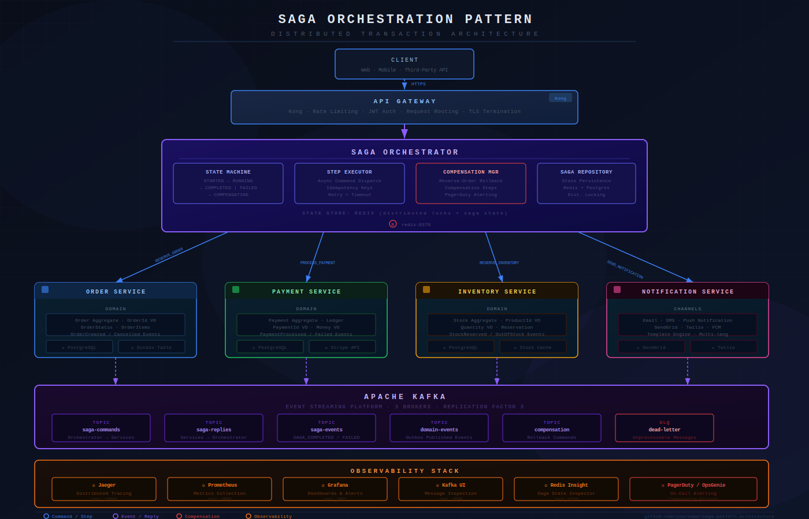

# 🔄 Saga Pattern Architecture — Distributed Transaction Management

[](https://github.com/Vegetam/Saga-pattern-architecture/actions/workflows/ci.yml)


> **Production-grade Saga Orchestration Pattern** for managing distributed transactions across microservices with full compensation logic, idempotency, and observability.



## 📐 Architecture Overview

```
┌─────────────────────────────────────────────────────────────────────┐
│                        API GATEWAY (Kong)                           │
│              Rate Limiting · Auth · Request Routing                 │
└───────────────────────────────┬─────────────────────────────────────┘
                                │
                                ▼
┌─────────────────────────────────────────────────────────────────────┐
│                    SAGA ORCHESTRATOR SERVICE                        │
│                                                                     │
│  ┌──────────────┐  ┌──────────────┐  ┌──────────────────────────┐  │
│  │  Saga State  │  │  Step Runner │  │  Compensation Manager    │  │
│  │   Machine    │  │  (Async)     │  │  (Rollback Logic)        │  │
│  └──────────────┘  └──────────────┘  └──────────────────────────┘  │
│                                                                     │
│  State Store: Redis (distributed locks) or in-memory (PoC)         │
└────────┬──────────────┬──────────────┬──────────────┬──────────────┘
         │              │              │              │
         ▼              ▼              ▼              ▼
  ┌──────────┐  ┌──────────────┐  ┌──────────┐  ┌────────────────┐
  │  Order   │  │   Payment    │  │Inventory │  │ Notification   │
  │ Service  │  │   Service    │  │ Service  │  │   Service      │
  │          │  │              │  │          │  │                │
  │ Postgres │  │  Postgres    │  │ Postgres │  │  Email/SMS     │
  │ (Orders) │  │  (Ledger)    │  │ (Stock)  │  │                │
  └──────────┘  └──────────────┘  └──────────┘  └────────────────┘
         │              │              │              │
         └──────────────┴──────┬───────┴──────────────┘
                               │
                    ┌──────────▼──────────┐
                    │    Apache Kafka     │
                    │                    │
                    │  Topics:           │
                    │  • saga-*-commands │
                    │  • saga-replies    │
                    │  • saga-events     │
                    │  • *.dlq           │
                    └────────────────────┘
```

> Note: Kong is shown as an optional API gateway. It is **not** included in `docker-compose.yml`.

---

## 🧩 Saga Flow — Order Processing

```
Client ──► Orchestrator: CREATE_ORDER_SAGA
              │
              ├─Step 1──► OrderService: RESERVE_ORDER
              │           ◄── SUCCESS: order_id=123, status=RESERVED
              │
              ├─Step 2──► PaymentService: PROCESS_PAYMENT
              │           ◄── SUCCESS: payment_id=456, amount=99.99
              │
              ├─Step 3──► InventoryService: RESERVE_INVENTORY
              │           ◄── FAILURE: insufficient_stock
              │
              │  ⚠ COMPENSATION TRIGGERED (reverse order)
              │
              ├─Comp 2──► PaymentService: REFUND_PAYMENT (payment_id=456)
              │           ◄── SUCCESS: refund_id=789
              │
              ├─Comp 1──► OrderService: CANCEL_ORDER (order_id=123)
              │           ◄── SUCCESS: status=CANCELLED
              │
              └──► Client: ORDER_FAILED (saga_id=xxx, reason=OUT_OF_STOCK)
```

---

## 🏗️ Key Design Decisions

### 1. Orchestration vs Choreography
We chose **orchestration** — see [ADR-001](docs/adr/001-orchestration-vs-choreography.md) for full reasoning.

### 2. Idempotency
Every saga step is idempotent via idempotency keys — see [ADR-004](docs/adr/004-idempotency-strategy.md).

### 3. Saga State Machine

```
STARTED → RUNNING → COMPLETED
        → RUNNING → COMPENSATING → FAILED
                  → COMPENSATION_FAILED  (needs manual intervention — see runbook)
```

---

## 📁 Project Structure

```
├── saga-orchestrator/
│   ├── src/
│   │   ├── SagaOrchestrator.ts          # Core orchestration engine + saga registry
│   │   ├── SagaStateMachine.ts          # State transitions + validation
│   │   ├── CompensationManager.ts       # Reverse-order rollback logic
│   │   ├── StepExecutor.ts              # Async step dispatch with retry + timeout
│   │   ├── SagaRepository.ts            # All DB access for saga state
│   │   ├── saga-bootstrap.service.ts    # Registers saga definitions + Kafka consumers
│   │   ├── db-init.service.ts           # Idempotent schema bootstrap on startup
│   │   ├── app.module.ts                # NestJS module wiring
│   │   ├── main.ts                      # NestJS bootstrap (Fastify + shutdown hooks)
│   │   ├── sagas/
│   │   │   └── order.saga.ts            # OrderSaga step definitions
│   │   ├── controllers/
│   │   │   ├── orders.controller.ts     # POST /api/orders — start order saga
│   │   │   ├── sagas.controller.ts      # GET /api/sagas/:id — saga status
│   │   │   ├── metrics.controller.ts    # GET /metrics — Prometheus scrape endpoint
│   │   │   └── probes.controller.ts     # GET /live  GET /ready (K8s probes)
│   │   ├── metrics/
│   │   │   └── metrics.service.ts       # Prometheus counters (prom-client)
│   │   ├── entities/
│   │   │   └── saga.entity.ts           # TypeORM entity
│   │   ├── kafka/
│   │   │   └── kafka.service.ts         # Kafka producer + consumer (DLQ + retry)
│   │   └── redis/
│   │       └── redis.service.ts         # Distributed locks + in-memory fallback
│   ├── Dockerfile
│   ├── tsconfig.json
│   └── package.json
│
├── services/
│   ├── order-service/src/index.ts       # RESERVE_ORDER + CANCEL_ORDER handlers
│   ├── payment-service/src/index.ts     # PROCESS_PAYMENT + REFUND_PAYMENT handlers
│   ├── inventory-service/src/index.ts   # RESERVE_INVENTORY + RELEASE_INVENTORY handlers
│   └── notification-service/src/index.ts  # SAGA_COMPLETED / SAGA_FAILED email+SMS
│
├── deploy/
│   ├── helm/saga-pattern/               # Helm chart (Deployment, Service, HPA, PDB, Ingress)
│   ├── kustomize/                       # Kustomize base + kind overlay
│   ├── kind/                            # One-command local K8s cluster scripts
│   │   ├── create-cluster.sh
│   │   ├── install-bitnami-infra.sh     # Kafka + Redis + Postgres via Bitnami Helm
│   │   ├── build-images.sh
│   │   ├── deploy-app-helm.sh
│   │   └── port-forward-orchestrator.sh
│   └── README.md
│
├── docker/
│   ├── docker-compose.yml
│   └── prometheus.yml
│
└── docs/
    ├── saga-flow.svg
    ├── adr/
    │   ├── 001-orchestration-vs-choreography.md
    │   ├── 002-redis-for-saga-state.md
    │   ├── 003-kafka-for-commands.md
    │   └── 004-idempotency-strategy.md
    └── runbooks/
        └── compensation-failed.md
```

---

## 🚀 Running Locally

### Option A — Docker Compose (quickest)

```bash
# Start everything: Kafka, Redis, Postgres x4, Jaeger, Prometheus, Grafana
docker compose -f docker/docker-compose.yml up -d --build

# Trigger a test saga
curl -X POST http://localhost:3000/api/orders \
  -H "Content-Type: application/json" \
  -d '{
    "customerId": "cust-123",
    "items": [{"productId": "a0000000-0000-0000-0000-000000000001", "qty": 2, "unitPrice": 49.99}],
    "paymentMethod": "card_xxxx_4242"
  }'

# Monitor saga state
curl http://localhost:3000/api/sagas/{saga_id}

# View Kafka messages
open http://localhost:8090   # Kafka UI

# View distributed traces
open http://localhost:16686  # Jaeger

# View metrics dashboard
open http://localhost:3001   # Grafana (admin / admin)
```

### Option B — In-memory state store (no Redis required)

```bash
SAGA_STATE_STORE=memory docker compose -f docker/docker-compose.yml up -d --build
```

### Option C — Kubernetes via kind + Helm

Prereqs: `docker`, `kubectl`, `helm`, `kind`

```bash
cd deploy/kind

./create-cluster.sh               # Create local K8s cluster
./install-bitnami-infra.sh        # Install Kafka, Redis, Postgres via Bitnami Helm
./build-images.sh                 # Build Docker images
./deploy-app-helm.sh              # Deploy app via Helm
./port-forward-orchestrator.sh    # Expose orchestrator on localhost:8080

# Health checks
curl http://localhost:8080/live
curl http://localhost:8080/ready
```

See [`deploy/README.md`](deploy/README.md) for Kustomize instructions and production notes.

---

## 🔍 Observability

| Tool | Purpose | Port |
|------|---------|------|
| **Jaeger** | Distributed tracing across saga steps | :16686 |
| **Prometheus** | Metrics scraping (`GET /metrics`) | :9090 |
| **Grafana** | Metrics dashboard | :3001 |
| **Kafka UI** | Message inspection and replay | :8090 |

### Prometheus Metrics

| Metric | Type | Description |
|--------|------|-------------|
| `saga_started_total` | Counter | Sagas started, labeled by `sagaName` |
| `saga_completed_total` | Counter | Sagas completed successfully, labeled by `sagaName` |
| `saga_failed_total` | Counter | Sagas failed after compensation, labeled by `sagaName` |
| Node.js defaults | Various | CPU, memory, GC, event loop (via `prom-client`) |

---

## 🛡️ Resilience Patterns

- **Distributed Locking** — Redis `SET NX PX` prevents duplicate step execution across pods
- **Idempotency Keys** — each step and compensation is safe to retry
- **Retry with Exponential Backoff** — Kafka consumer retries with jitter before routing to DLQ
- **Dead Letter Queue** — unprocessable messages sent to `{topic}.dlq` after max retries
- **Step Timeout** — Redis TTL-based timeout per step
- **`COMPENSATION_FAILED` state** — on-call alerting for stuck compensations (see [runbook](docs/runbooks/compensation-failed.md))
- **Graceful shutdown** — `enableShutdownHooks()` for clean Kubernetes pod termination
- **Readiness probe** — `/ready` checks Postgres, Kafka, and Redis before accepting traffic

---

## 🧪 Testing

```bash
cd saga-orchestrator

npm run test:unit          # State machine logic, compensation ordering
npm run test:integration   # With real Kafka + Postgres
npm run test:chaos         # Kill services mid-saga
npm run test:load          # Concurrent sagas (requires Artillery)
```

---

## 📚 Architecture Decision Records

- [ADR-001](docs/adr/001-orchestration-vs-choreography.md) — Why orchestration over choreography
- [ADR-002](docs/adr/002-redis-for-saga-state.md) — Redis as distributed lock store
- [ADR-003](docs/adr/003-kafka-for-commands.md) — Kafka command channels
- [ADR-004](docs/adr/004-idempotency-strategy.md) — Idempotency key design
